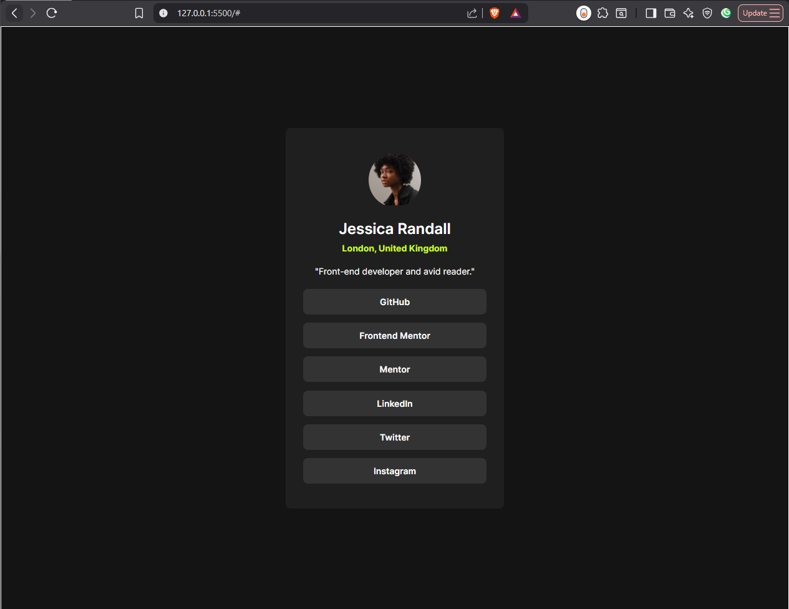
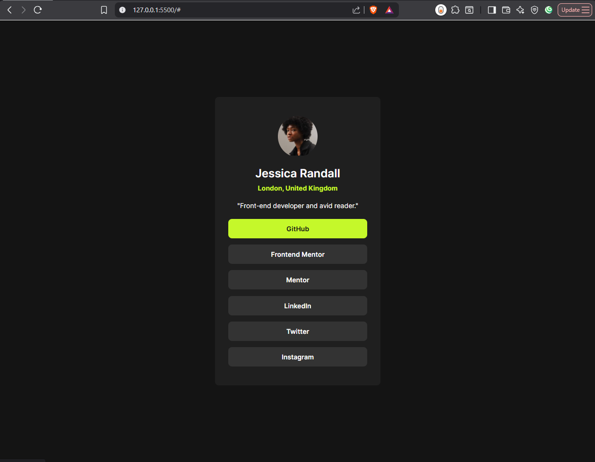
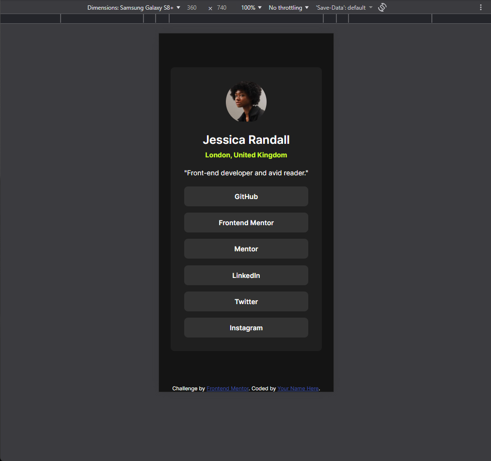

# Frontend Mentor - Social links profile solution

This is a solution to the [Social links profile challenge on Frontend Mentor](https://www.frontendmentor.io/challenges/social-links-profile-UG32l9m6dQ).

## Table of contents

- [Frontend Mentor - Social links profile solution](#frontend-mentor---social-links-profile-solution)
  - [Table of contents](#table-of-contents)
  - [Overview](#overview)
    - [Screenshot](#screenshot)
      - [Desktop Preview](#desktop-preview)
      - [Desktop Hover Preview](#desktop-hover-preview)
      - [Mobile Preview](#mobile-preview)
    - [Links](#links)
  - [My process](#my-process)
    - [Built with](#built-with)
  - [Author](#author)

## Overview

### Screenshot

#### Desktop Preview

#### Desktop Hover Preview

#### Mobile Preview

### Links

- Solution URL: [GitHub repo URL here](https://github.com/JNedelinov/social-links-profile)
- Live Site URL: [Live site URL here](https://jnedelinov-social-linjs-profile.netlify.app/)

## My process

### Built with

- Semantic HTML5 markup
- CSS custom properties
- Flexbox

## Author

- Frontend Mentor - [@JNedelinov](https://www.frontendmentor.io/profile/JNedelinov)